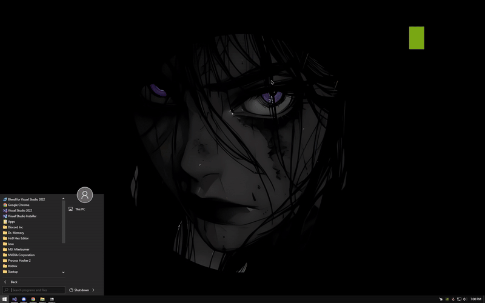

# DllMain :)

**Última atualização:** 22/09/2024

---

## Sobre

Muitos estão vendendo DLL em C#, mesmo sendo relativamente fácil de criar. Infelizmente, existe uma tendência entre alguns brasileiros de focarem apenas no lucro, negligenciando o compartilhamento de conhecimento.

O método consiste em:
- Usar um conversor de binário.
- Extrair o shellcode usando HxD.
- Buildar o projeto usando XShellInject.

Apesar de simples, algumas pessoas vendem esse conhecimento de forma indevida.

---

## Preview

